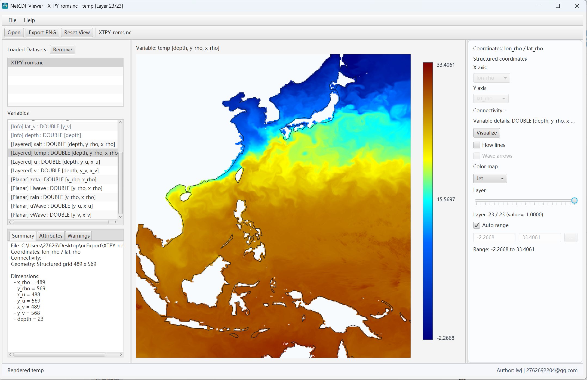
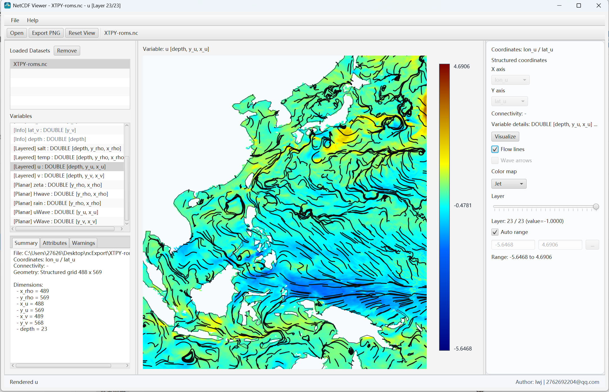
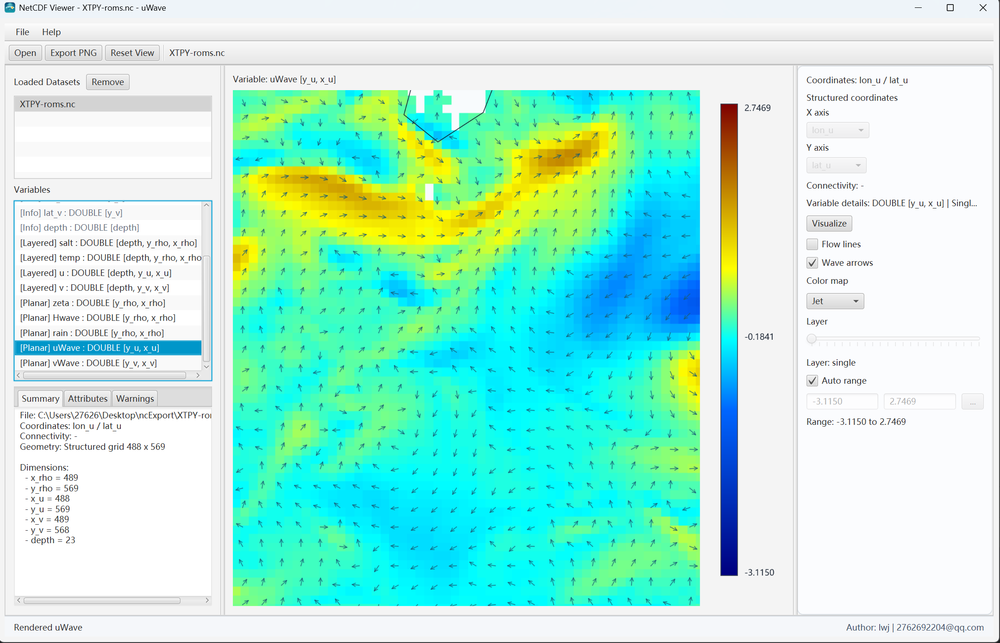
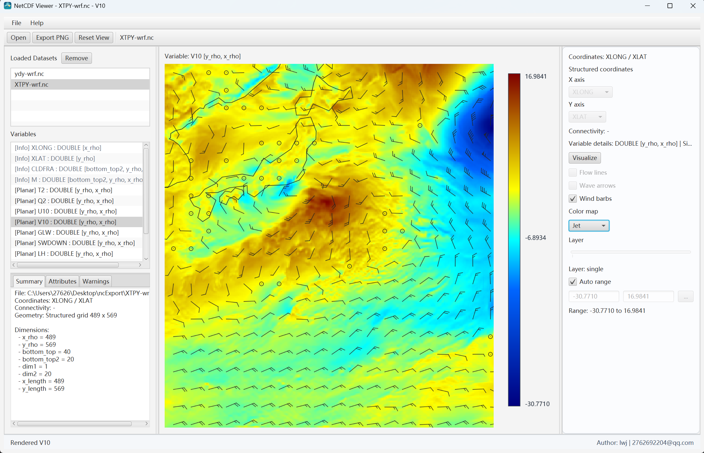
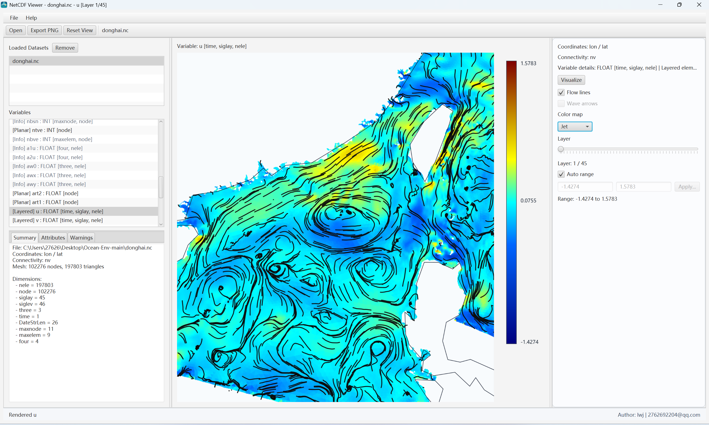
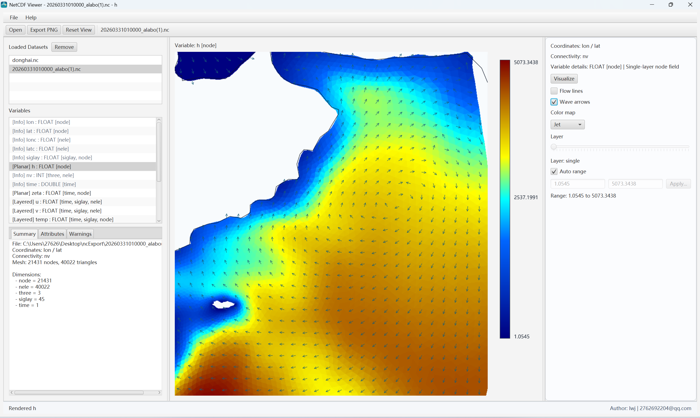
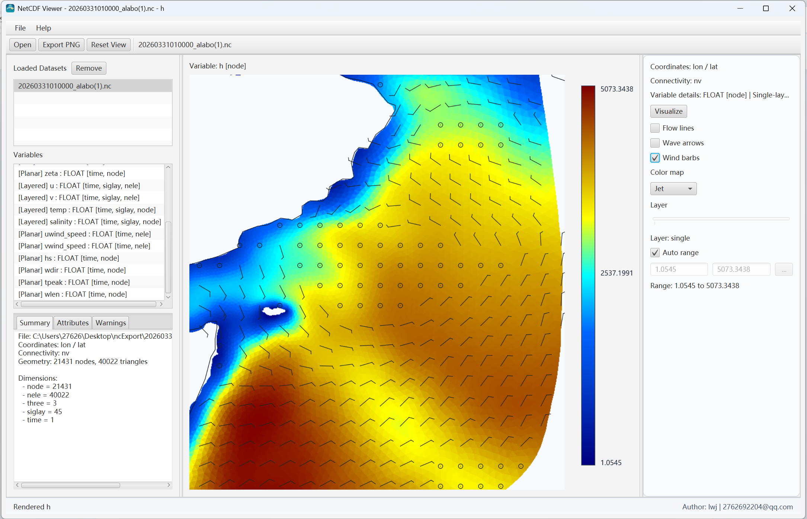

# NetCDF Viewer

基于 JavaFX 的 NetCDF 桌面可视化工具。面向海洋、水文、环境和数值模拟数据分析场景，支持非结构化三角网与规则格网 `.nc` 数据读取、二维平面渲染、单点查询、多数据集管理、海岸线叠加、波浪叠加、海流流线叠加、风场风羽叠加与 PNG 导出。

当前版本：`1.1.1`

## 这个项目能做什么

- 读取非结构化三角网 NetCDF 和规则格网 NetCDF
- 自动识别坐标变量、连接关系、结构化坐标基准和可渲染变量
- 支持单层变量、多层变量和深度层切换
- 支持在一个会话里连续加载多个 `.nc` 文件，并切换或删除当前数据集
- 支持平面图单点查询
- 支持 GeoJSON / shapefile 海岸线叠加，并内置默认海岸线
- 支持波浪、海流、风场三类矢量叠加
- 支持导出当前视图为 PNG
- 支持打包为独立 Windows 安装程序 `.exe`

## 支持的数据与叠加类型

### 1. 非结构化三角网

适用于带节点坐标和三角形连接关系的海洋模式输出。

- 标量场：节点中心 / 单元中心二维填色
- 海流流线：自动识别 `u` / `v`，兼容 `ua` / `va`
- 波浪箭头：自动识别 `wdir` / `wlen`
- 风场风羽：自动识别 `uwind_speed` / `vwindspeed`，兼容 `uwind_speed` / `vwind_speed`

### 2. 规则格网

适用于带一维横纵坐标、结构化水平维度的规则格网数据，包含普通规则网格和交错网格场景。

- 标量场：支持单层 / 多层平面渲染
- 坐标基准：按变量自动匹配兼容横纵坐标，并允许用户切换候选坐标轴
- 单点查询：返回命中行列位置和值
- 海流流线：自动识别 `u` / `v`
- 波浪箭头：存在 `uWave` / `vWave` 即可渲染，若存在 `Hwave` / `hWave` 会参与箭头长度表达
- 风场风羽：自动识别 `U10` / `V10`

## 功能亮点

- 三角网和规则格网共用一套主控制链路，交互一致
- 结构化数据不写死变量名维度组合，按变量和坐标基准动态匹配
- 叠加能力不是只支持一种网格类型，海流、波浪、风场都能在兼容数据上自动启用
- 内置海岸线直接打进程序和安装包，不需要用户另找底图边界
- 多数据集切换后会同步刷新变量列表、查询上下文和叠加状态
- 测试覆盖了解析、采样、控制器交互、导出和打包脚本

## 界面预览

### 规则格网标量渲染

规则格网多层温度场渲染，展示坐标基准切换、分层滑块和统一色标。



### 规则格网海流流线

规则格网 `u` / `v` 海流场叠加，适合看大范围流向、回流和局部旋涡结构。



### 规则格网浪场箭头

规则格网 `uWave` / `vWave` 浪场叠加，适合看浪向和局部波场分布。



### 规则格网风场风羽

规则格网 `U10` / `V10` 风场叠加，使用风羽标记直接表达近地风场方向和强弱。



### 三角网海流流线

三角网 `u` / `v` 海流场叠加，保留原始海域边界和局部曲线流动结构。



### 三角网浪场箭头

三角网 `wdir` / `wlen` 波浪叠加，用于快速判断波向传播趋势。



### 三角网风场风羽

三角网风场叠加，自动识别风场变量对后启用独立 `Wind barbs` 开关。



## 快速开始

### 1. 运行测试

```powershell
mvn -q test
```

如果本地没有示例 `.nc` 文件，依赖本地样例的补充测试会自动跳过，不会导致公开仓库的基础回归失败。

### 2. 开发模式启动

```powershell
mvn javafx:run
```

### 3. 打包 Windows 安装程序

```powershell
powershell -ExecutionPolicy Bypass -File .\scripts\package-exe.ps1
```

安装包输出目录：

- `target\installer\NetCDFViewer-<version>.exe`

## 使用流程

1. 通过菜单、按钮或拖拽方式打开一个或多个 `.nc` 文件
2. 在左侧数据集列表中切换当前活动数据集
3. 在变量列表中选择需要显示的变量
4. 如果变量有深度层，在右侧滑块切层
5. 如果数据中存在兼容的矢量变量对，按需启用 `Flow lines`、`Wave arrows`、`Wind barbs`
6. 点击画布执行单点查询
7. 点击 `Export PNG` 导出当前视图

## 自动识别规则

### 海流流线

- 三角网 / 规则格网：`u` / `v`
- 三角网兼容：`ua` / `va`

### 波浪箭头

- 三角网：`wdir` / `wlen`
- 规则格网：`uWave` / `vWave`
- 规则格网可选增强：`Hwave` / `hWave`

### 风场风羽

- 三角网：`uwind_speed` / `vwindspeed`
- 三角网兼容：`uwind_speed` / `vwind_speed`
- 规则格网：`U10` / `V10`

## 技术栈

- Java 17+
- JavaFX 21
- NetCDF-Java 5.9.x
- Maven
- JUnit 5
- jpackage

## 运行环境

- 开发环境建议：JDK 17 及以上
- 构建工具：Maven 3.9 及以上
- 打包平台：Windows
- 当前项目已在 Java 21 环境下完成测试与安装包生成验证

## 工程结构

```text
docs/
├── images/
│   └── readme/          # README 截图资源
└── superpowers/         # 设计稿与实现计划

samples/
└── coastline/           # 海岸线样例数据

scripts/
├── package-exe.ps1      # Windows 安装包打包脚本
└── package-linux-x86.ps1

src/
├── main/
│   ├── java/com/example/netcdfviewer/
│   │   ├── io/          # NetCDF 解析、变量识别、坐标绑定判断
│   │   ├── model/       # 空间域、变量信息、变量配对模型
│   │   ├── overlay/     # 海岸线叠加加载与绘制
│   │   ├── render/      # 标量渲染、流线、波浪箭头、风羽采样与绘制
│   │   └── ui/          # JavaFX 界面与主控制器
│   └── resources/
│       ├── coastline/   # 内置海岸线资源
│       └── icons/       # 应用与安装包图标
└── test/
    └── java/com/example/netcdfviewer/
        ├── io/
        ├── overlay/
        ├── render/
        ├── runtime/
        ├── smoke/
        ├── testsupport/
        └── ui/
```

## 数据文件说明

根目录本地 `.nc` 样例文件默认通过 `.gitignore` 排除，不会直接提交到公开仓库。

这意味着：

- 公开仓库默认只保留源码、脚本、文档、测试和截图资源
- 运行程序时请自行准备业务数据或样例数据
- 如果本地没有样例 `.nc`，补充型校验测试会自动跳过
- 如果准备公开演示样例数据，建议通过单独下载包或发行页提供

## 质量状态

当前版本已完成以下验证：

- Maven 全量测试通过
- 规则格网识别、标量渲染、单点查询、坐标轴切换回归测试通过
- 海流流线、波浪箭头、风场风羽在三角网和规则格网上的识别与采样回归测试通过
- 多数据集管理、海岸线叠加、PNG 导出回归测试通过
- 打包脚本与运行时模块集兼容性测试通过
- Windows 安装包生成通过

## 常见问题

### 为什么仓库里没有示例 `.nc` 文件？

因为样例文件体积大，直接入库会让仓库过重，也不利于公开分发。当前仓库默认只提交源码和文档资源。

### 为什么不能直接双击 `jar` 运行？

本项目依赖 JavaFX 运行时。开发阶段请使用 `mvn javafx:run`，分发阶段请使用打包生成的 `.exe` 安装程序。

### 是否支持所有 NetCDF 文件？

不支持。当前主要支持两类数据：

- 带节点坐标和三角形连接关系的非结构化三角网 NetCDF
- 带可识别横纵坐标基准的规则格网 NetCDF

如果文件缺少关键坐标、连接关系或水平基准，程序可以读元数据，但不能保证平面渲染。

### 导出的 PNG 异常怎么办？

当前版本已经加入导出后读回校验。如果导出失败，程序会报错，不会静默写出损坏文件。

## Roadmap

- 时间步动画
- 等值线和剖面联动
- 更多颜色表和样式模板
- 渲染参数保存 / 恢复
- 更完整的公开样例数据说明页

## 贡献

欢迎通过 Issue 或 Pull Request 提交问题反馈、功能建议和代码改进。

- [CONTRIBUTING.md](CONTRIBUTING.md)

## 版本记录

- [CHANGELOG.md](CHANGELOG.md)

## 开源许可证

- [LICENSE](LICENSE)

## 作者

- lwj
- 2762692204@qq.com
