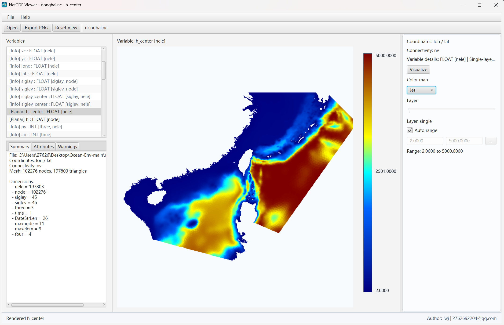
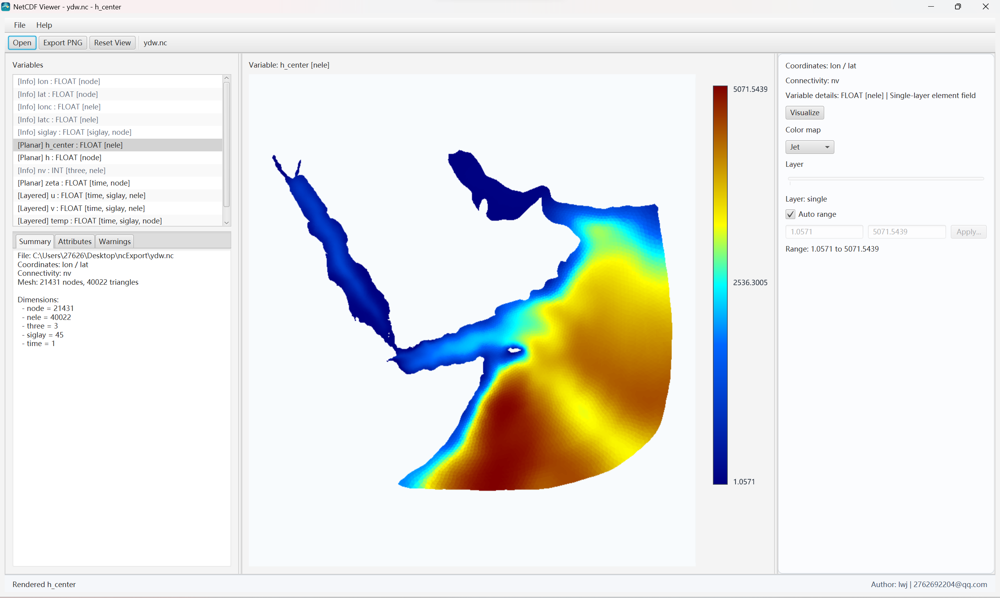

# NetCDF Viewer

一款基于 JavaFX 的 NetCDF 非结构化三角网桌面可视化工具，支持读取包含节点坐标、三角形连接关系和属性变量的 `.nc` 文件，并进行二维平面填色显示、深度层切换与 PNG 导出。

## 项目定位

本项目面向海洋、水文、环境与数值模拟数据处理场景，重点解决以下问题：

- 读取非结构化三角网 NetCDF 数据
- 自动识别节点坐标与三角形连接关系
- 对单层与多层属性变量进行平面可视化
- 在 Windows 环境下生成可直接分发的安装包

## 项目亮点

- 面向非结构化三角网场景，而非仅支持规则网格
- 自动识别坐标变量、连接关系与可平面化属性变量
- 同时支持节点中心与单元中心属性变量显示
- 支持多层变量深度切换，适用于海洋与水文剖面类数据
- 支持导出当前视图为 PNG，便于报告、汇报与结果归档
- 支持打包为无需额外安装 JRE 的 Windows 安装程序

## 主要功能

- 支持通过菜单或拖拽方式打开 `.nc` 文件
- 展示变量、维度、全局属性、坐标变量和连接变量信息
- 支持单层变量与多层变量的平面渲染
- 支持深度层切换
- 支持颜色映射与当前层最小值 / 最大值显示
- 支持导出当前可视化结果为 PNG 图片
- 支持打包为独立 Windows 安装程序 `.exe`

## 技术栈

- Java 17+
- JavaFX 21
- NetCDF-Java 5.9.x
- Maven
- JUnit 5
- jpackage

## 运行环境

- 开发环境建议：JDK 17 及以上
- 构建工具：Maven 3.9 及以上
- 打包平台：Windows
- 当前项目已在 Java 21 环境下完成测试与打包验证

## 快速开始

### 1. 运行测试

```powershell
mvn -q test
```

公开仓库或 CI 环境如果没有本地 `.nc` 样例文件，也可以直接运行这条命令。
依赖本地样例数据的补充校验测试会自动跳过，不会导致全量测试失败。

### 2. 开发模式启动

```powershell
mvn javafx:run
```

### 3. 打包为 Windows 安装程序

```powershell
powershell -ExecutionPolicy Bypass -File .\scripts\package-exe.ps1
```

打包完成后，安装包位于：

- `target\installer\NetCDFViewer-<version>.exe`

## 界面预览

应用主界面主要由以下区域组成：

- 顶部菜单栏与工具栏
- 左侧变量与元数据面板
- 中央三角网平面渲染区域
- 右侧图层、颜色映射和范围控制区
- 底部状态栏与作者信息

下面给出两个实际运行界面示例。

### 示例 1：`donghai.nc` 单层单元变量平面渲染

该示例展示了单层单元变量 `h_center` 的二维平面填色结果，界面中可同时看到变量列表、网格渲染主图、颜色条和右侧参数控制区，适合体现软件的整体布局与核心使用流程。



### 示例 2：`ydw.nc` 数据渲染界面

该示例展示了 `ydw.nc` 数据文件在软件中的实际显示效果，可直观看到非结构化三角网属性在海域范围内的空间分布情况，同时保留了右侧颜色映射与范围控制信息。



如果后续准备进一步完善公开展示效果，建议继续补充：

- 主界面截图
- 打开示例数据后的渲染截图
- 多层变量切换截图
- PNG 导出结果示例图

## 使用说明

### 打开数据

启动后可通过以下方式打开 NetCDF 文件：

- 菜单栏 `File -> Open...`
- 主界面按钮 `Open`
- 直接拖拽 `.nc` 文件到窗口

### 可视化流程

1. 打开数据文件
2. 在左侧变量列表中选择可平面化变量
3. 若变量包含深度维，则使用右侧滑块切换层
4. 主图区域显示当前层平面图
5. 如需导出，点击 `Export PNG`

## 工程结构

```text
src/
├── main/
│   ├── java/com/example/netcdfviewer/
│   │   ├── io/          # NetCDF 解析
│   │   ├── model/       # 网格与变量模型
│   │   ├── render/      # 渲染与颜色映射
│   │   └── ui/          # JavaFX 界面与控制器
│   └── resources/
│       └── icons/       # 应用与安装包图标
└── test/
    └── java/com/example/netcdfviewer/
        ├── io/
        ├── render/
        ├── runtime/
        ├── smoke/
        └── ui/
```

## 数据文件说明

为了避免仓库体积过大，根目录中的本地 `.nc` 示例数据已在 `.gitignore` 中排除，不会提交到公开仓库。

这意味着：

- 公开仓库默认只包含源码、脚本、文档和测试代码
- 运行时请自行准备 NetCDF 示例文件
- 当根目录没有本地 `.nc` 样例文件时，相关本地样例校验测试会自动跳过
- 如需公开发布样例数据，建议单独提供下载地址或发布压缩包

## Roadmap

以下是适合后续继续完善的方向：

- 补充正式的界面截图与演示图片
- 增加更多异常数据格式的兼容性说明
- 支持导出当前渲染参数配置
- 增加更丰富的颜色表与用户自定义范围模板
- 评估加入等值线、调试编号显示等扩展能力
- 提供公开可下载的示例数据集说明页

## 开源发布建议

如果你准备将项目发布到 GitHub / Gitee，建议至少包含以下内容：

- 中文 `README`
- 明确的开源许可证
- 贡献说明
- 版本变更记录

本仓库已补充上述基础文件，适合继续整理后对外公开。

## 质量状态

当前版本已完成以下验证：

- Maven 全量测试通过
- 无本地样例文件的公开仓库 / CI 环境可直接运行测试，本地样例校验会自动跳过
- PNG 导出可写入且可读回验证通过
- 打包运行时模块集验证通过
- Windows 安装包生成成功

## 常见问题

### 1. 为什么仓库里没有示例 `.nc` 文件？

因为示例文件体积较大，直接提交到公开仓库会让仓库变得臃肿，也不利于后续克隆和分发。因此默认通过 `.gitignore` 排除。
如果当前环境没有这些本地样例文件，相关补充测试会自动跳过，不影响公开仓库的基础测试通过。

### 2. 为什么不能直接双击 `jar` 运行？

本项目依赖 JavaFX 运行时，普通 `jar` 不是完整分发包。开发时请使用 `mvn javafx:run`，分发时请使用打包生成的 `.exe` 安装程序。

### 3. 导出的 PNG 如果异常怎么办？

当前版本已经加入导出后读回校验。如果导出失败，程序应直接报错而不是静默生成损坏文件。若仍有问题，请优先反馈运行环境、数据文件类型和操作步骤。

### 4. 是否支持所有 NetCDF 文件？

不支持。当前项目主要面向带有节点坐标、三角形连接关系和属性变量的非结构化三角网 NetCDF 数据。对于缺少关键坐标或连接关系的文件，程序只会显示元数据而无法平面渲染。

## 贡献

欢迎通过 Issue 或 Pull Request 提交问题反馈、功能建议和改进代码。

详细说明请见：

- [CONTRIBUTING.md](CONTRIBUTING.md)

## 版本记录

版本说明见：

- [CHANGELOG.md](CHANGELOG.md)

## 开源许可证

本项目采用 MIT License 开源：

- [LICENSE](LICENSE)

## 作者信息

- 作者：lwj
- 邮箱：2762692204@qq.com
